# Task Manager

Mini application de gestion de tâches avec authentification, développée dans le cadre du test technique. L'utilisateur peut créer un compte, se connecter, puis créer, consulter, modifier, rechercher et supprimer ses propres tâches.

## Stack technique

**Backend**

- Java 21
- Spring Boot 4.1.1
- Spring Data JPA
- Spring Security 7
- MySQL
- JWT (jjwt)
- Swagger / OpenAPI (springdoc)

**Frontend**

- React
- Vite
- TypeScript
- Tailwind CSS v4

## Architecture

Le dépôt est organisé en monorepo avec trois éléments à la racine :

- `task_manager_backend/` — API REST Spring Boot
- `task_manager_frontend/` — application React
- `docker-compose.yml` — orchestre la base de données MySQL et le frontend

### Backend

Le code est structuré en couches classiques :

- `model` — entités JPA
- `repository` — accès aux données (Spring Data JPA)
- `service` — logique métier, séparée en interfaces et implémentations (`impl`)
- `controller` — endpoints REST
- `security` — configuration JWT et filtres d'authentification
- `config` — configuration Spring (sécurité, OpenAPI, etc.)
- `exception` — gestion centralisée des erreurs
- `mapper` — conversion entité ↔ DTO
- `dto` — objets de transfert utilisés par l'API

### Frontend

- `api` — appels HTTP vers le backend
- `context` — contextes React (authentification, thème clair/sombre)
- `components` — composants réutilisables
- `pages` — pages de l'application (login, register, dashboard, tâches)
- `types` — types TypeScript partagés

## Installation et exécution

### Prérequis

- Docker Desktop
- Java 21
- Node 18+ (recommandé pour le développement local hors conteneur, par exemple le lint, mais pas strictement obligatoire puisque le frontend tourne dans un conteneur Docker qui embarque Node 22)

### Étapes

1. Cloner le dépôt.

2. Copier le fichier d'exemple d'environnement à la racine, puis le dupliquer dans le dossier du backend. Les deux fichiers sont nécessaires : `docker-compose` lit celui de la racine pour configurer MySQL et le frontend, tandis que le backend lit le sien via la librairie `spring-dotenv` lorsqu'il est lancé nativement.

   ```bash
   cp .env.example .env
   cp .env.example task_manager_backend/.env
   ```

   Renseigner des valeurs réelles dans les deux fichiers pour `MYSQL_USER`, `MYSQL_PASSWORD`, `MYSQL_ROOT_PASSWORD` et `JWT_SECRET` — ne jamais garder les valeurs par défaut.

3. Lancer MySQL et le frontend :

   ```bash
   docker compose up -d
   ```

4. Lancer le backend :

   ```bash
   cd task_manager_backend
   ./mvnw spring-boot:run
   ```

   ou

   ```bash
   docker compose up -d
   ```

   (depuis la racine du monorepo)

### Accès

- Frontend : http://localhost:5173
- Backend : http://localhost:8080
- Documentation API interactive (Swagger) : http://localhost:8080/swagger-ui/index.html

## Déploiement en ligne

- Frontend déployé : https://taskmanagerfrontend-two.vercel.app
- Backend déployé : https://task-manager-cova-production.up.railway.app
- Documentation Swagger en ligne : https://task-manager-cova-production.up.railway.app/swagger-ui/index.html

Ces liens permettent de tester l'application directement sans installation locale, et un compte de test existe (email `test@test.com`, mot de passe `password123!`).

## Endpoints API

| Méthode | Chemin               | Description                                                         | Authentification |
| ------- | -------------------- | ------------------------------------------------------------------- | ---------------- |
| POST    | `/api/auth/register` | Créer un compte utilisateur                                         | Non              |
| POST    | `/api/auth/login`    | Se connecter et récupérer un token JWT                              | Non              |
| GET     | `/api/tasks`         | Lister les tâches de l'utilisateur (filtre par statut et recherche) | Oui              |
| POST    | `/api/tasks`         | Créer une tâche                                                     | Oui              |
| PUT     | `/api/tasks/{id}`    | Modifier une tâche                                                  | Oui              |
| DELETE  | `/api/tasks/{id}`    | Supprimer une tâche                                                 | Oui              |

La documentation interactive complète (schémas des requêtes/réponses, essai direct des endpoints) est disponible via Swagger à l'adresse mentionnée plus haut.

## Tests

Le backend dispose de tests unitaires sur la couche service (JUnit 5 + Mockito, 13 tests). Pour les lancer :

```bash
cd task_manager_backend
./mvnw test
```

Une collection Postman est également fournie dans `postman/TaskManager.postman_collection.json` pour tester l'API manuellement.

## Captures d'écran

Connexion

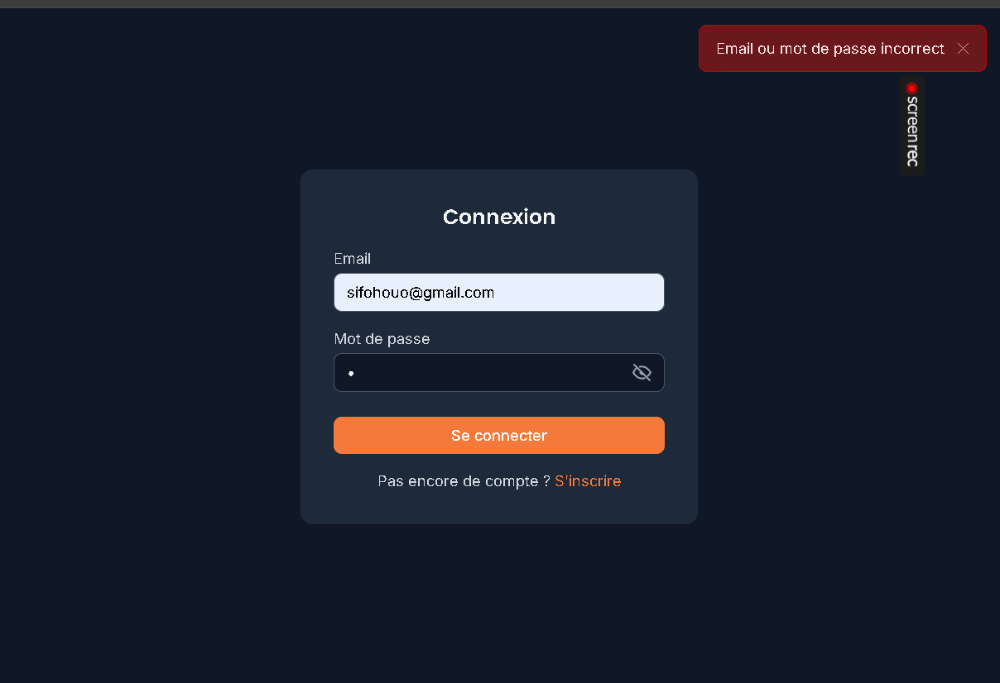

Erreur de connexion

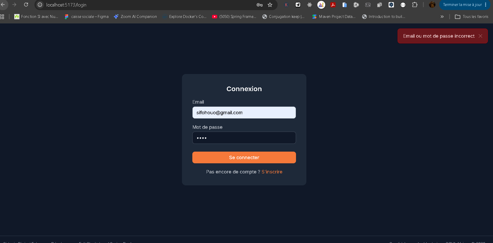

Erreur à l'inscription

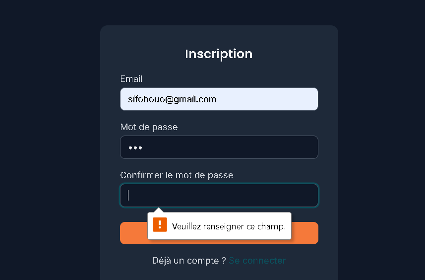

Bouton afficher/masquer le mot de passe

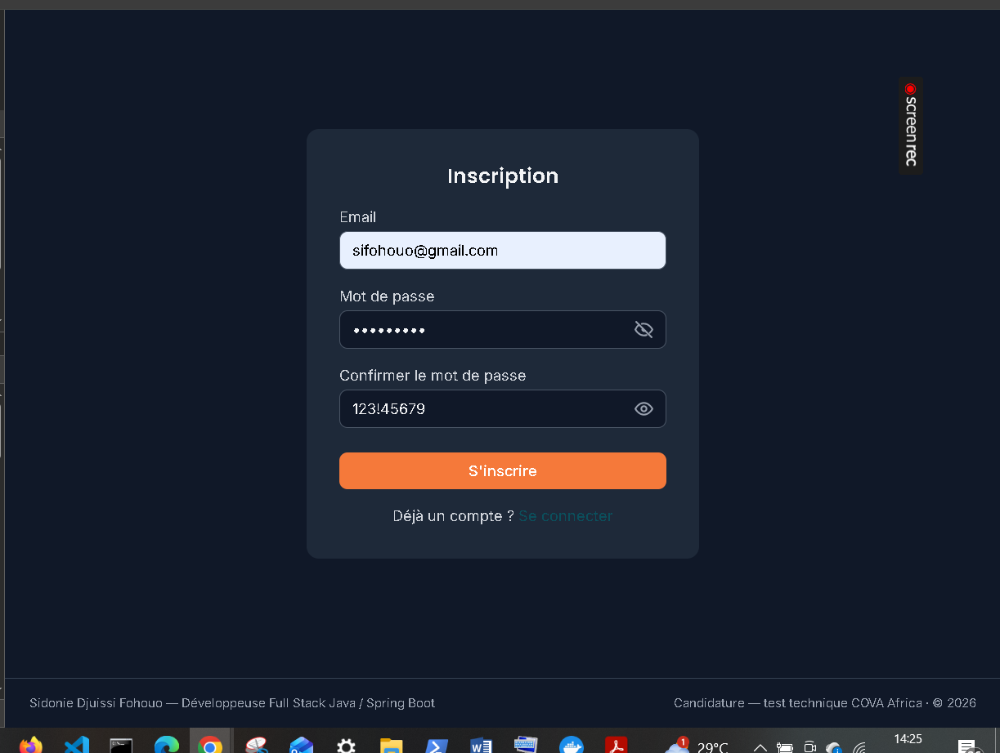

Erreur : les mots de passe ne correspondent pas


Liste des tâches

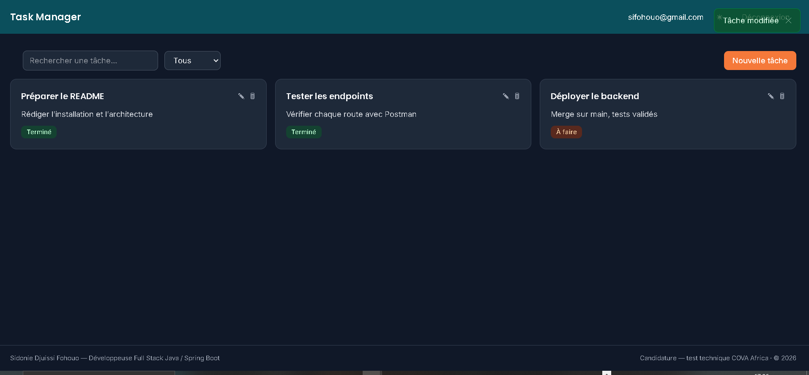

Filtrage des tâches par statut

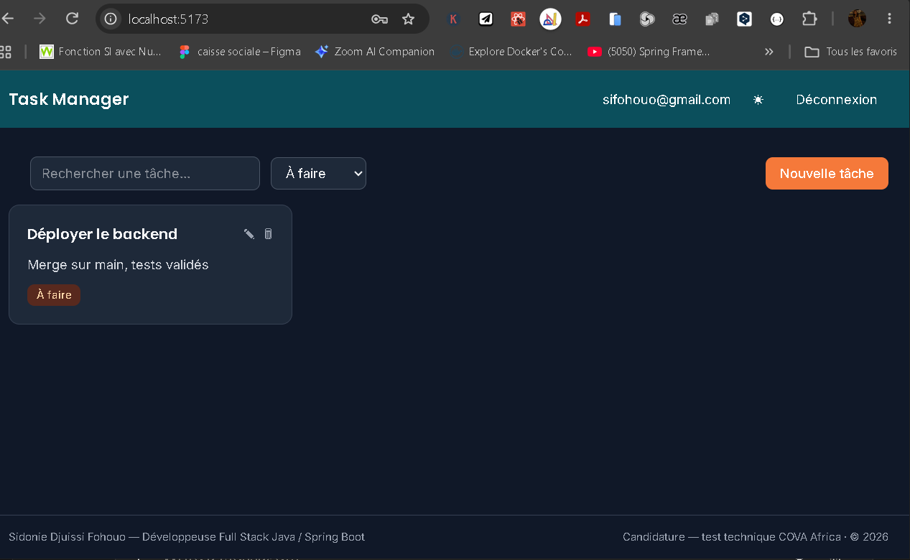

Modification d'une tâche

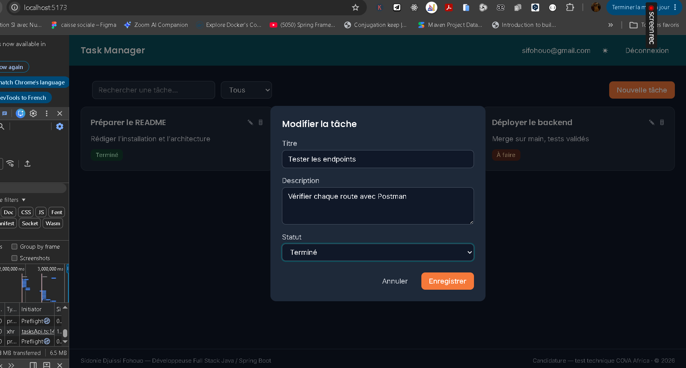

Création d'une nouvelle tâche

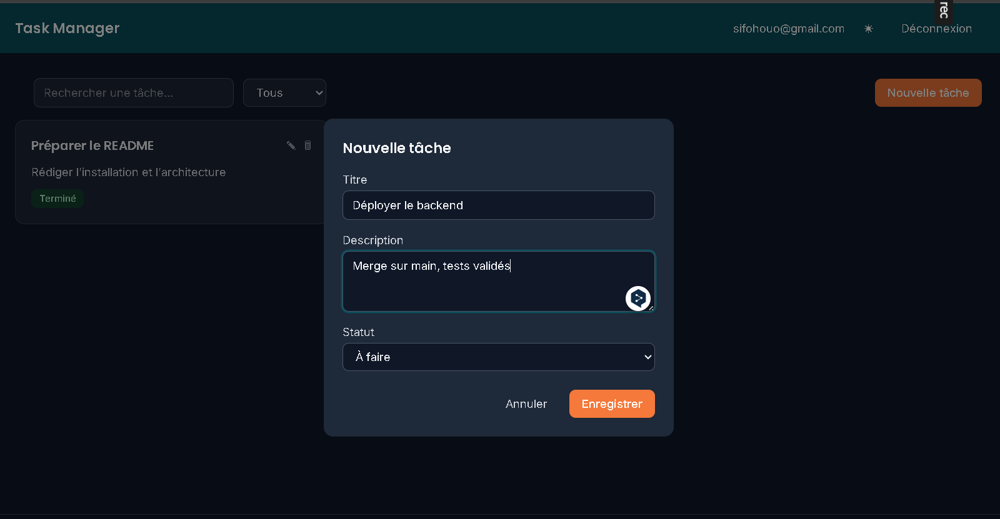

Notification après création d'une tâche

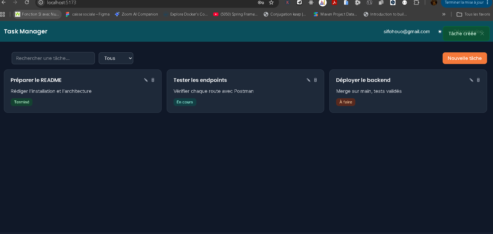

Recherche de tâche

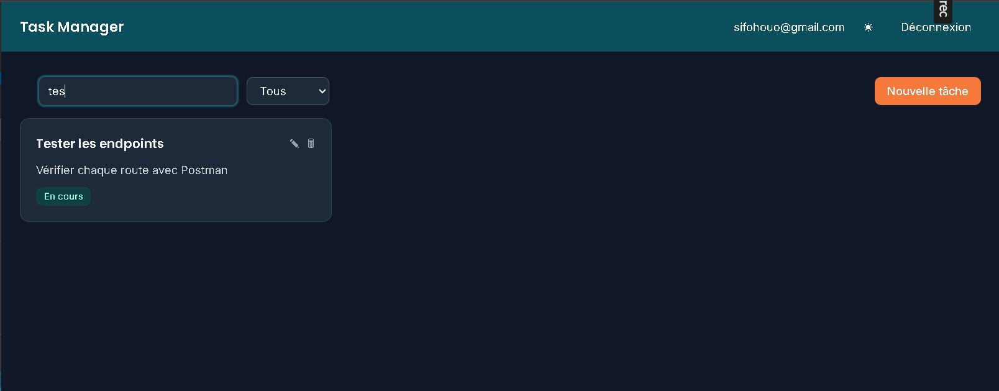

Suppression d'une tâche — il en reste deux

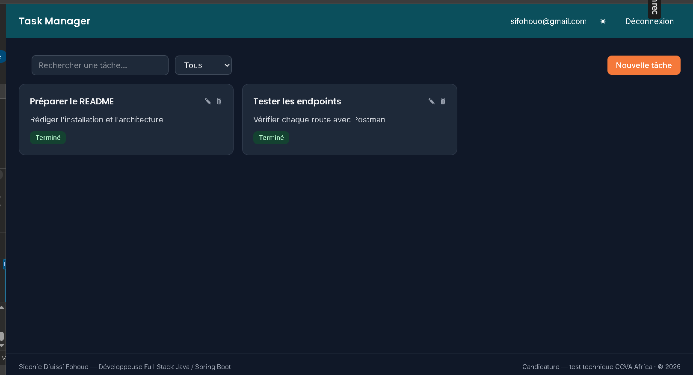

Notification après suppression

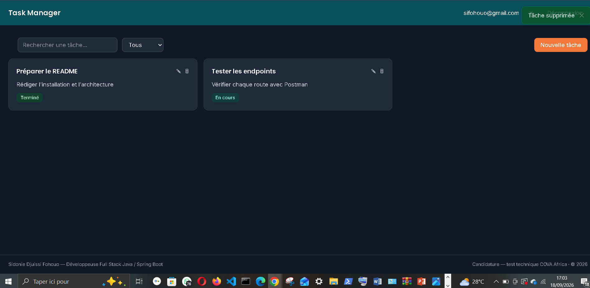

Suppression vérifiée côté backend

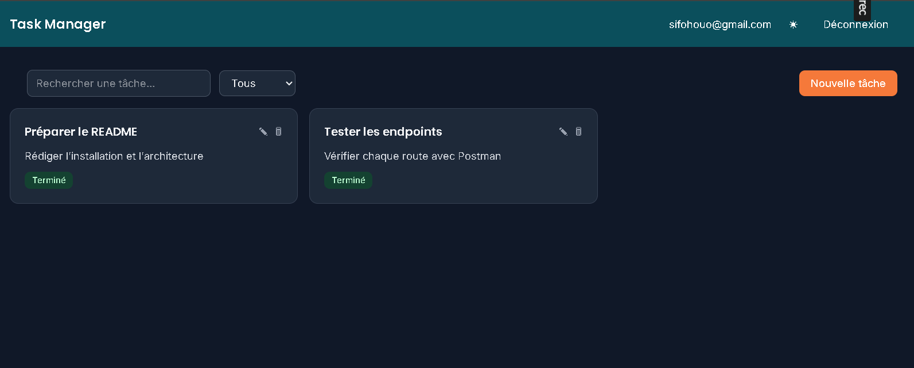

Suppression vérifiée côté backend (thème clair)

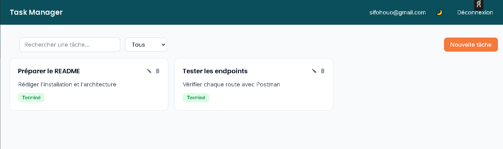

Documentation interactive de l'API via Swagger

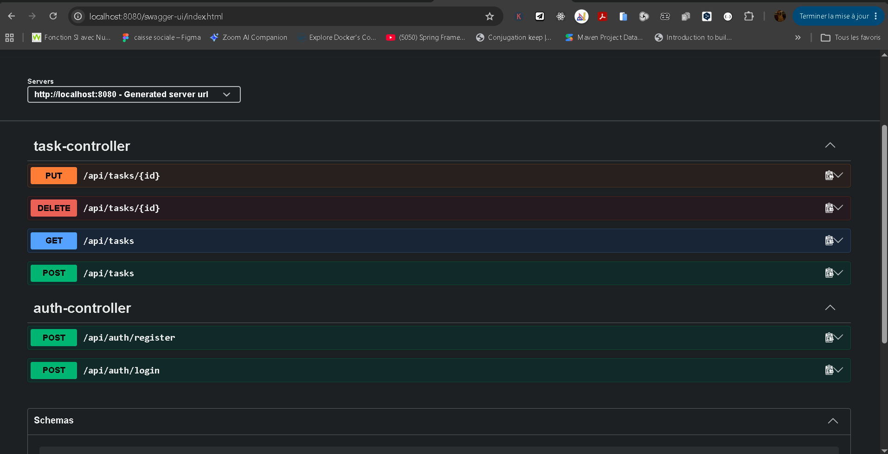

## Choix techniques

Le cahier des charges incluait deux volets bonus : une version mobile en Flutter et un pipeline CI/CD avec déploiement sur GCP. J'ai fait le choix de ne pas les traiter pour concentrer le temps disponible sur les exigences principales du test — l'API backend, l'authentification, le CRUD des tâches et le frontend React — plutôt que d'étaler l'effort sur des éléments bonus au détriment de la qualité du cœur du projet.

Pour la couche service, j'ai séparé les interfaces de leurs implémentations (`service` / `service/impl`). Ce n'est pas strictement nécessaire sur un projet de cette taille, mais ça facilite le mock dans les tests unitaires et ça garde une porte ouverte si le besoin de plusieurs implémentations se présente un jour.

Côté conteneurisation, les trois services (MySQL, backend et frontend) tournent désormais dans des conteneurs Docker, orchestrés par le même `docker-compose.yml`. Au départ, j'ai isolé le frontend dans un conteneur parce que Tailwind CSS v4 a besoin de Node 22, une version que je n'avais pas envie d'imposer en local. J'ai ensuite conteneurisé le backend à son tour pour permettre un déploiement complet du projet, tout en gardant la possibilité de le lancer nativement avec `./mvnw spring-boot:run` pendant le développement local, ce qui reste plus rapide pour itérer sans les allers-retours de rebuild d'image à chaque changement.

## Auteur

- Sidonie Djuissi Fohouo
- Développeuse Full Stack Java / Spring Boot
- LinkedIn : linkedin.com/in/sidonie-djuissi-fohouo
